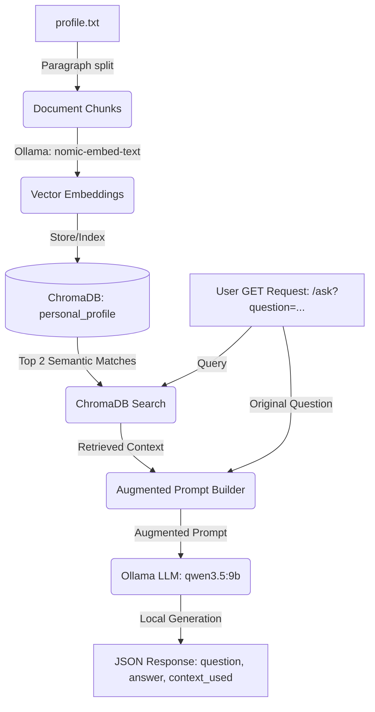

# BYO-RAG-AI (Build Your Own Retrieval-Augmented Generation AI)

A robust, fully local Retrieval-Augmented Generation (RAG) system built with **FastAPI**, **ChromaDB**, and **Ollama**. This project implements an intelligent, context-aware query assistant that retrieves information from a personal profile document and generates precise, grounded responses using locally hosted AI models.

---

## 🏗️ Architecture & Data Flow



---

## 🛠️ Tech Stack & Key Dependencies

*   **FastAPI**: A modern, high-performance web framework for building APIs with Python.
*   **ChromaDB**: An open-source vector database designed to store and query document embeddings.
*   **Ollama**: A lightweight tool for running Large Language Models (LLMs) locally.
*   **nomic-embed-text**: A high-performance text embedding model used to represent semantic meaning as vectors.
*   **qwen3.5:9b**: A state-of-the-art 9-billion parameter language model optimized for logical reasoning and instruction-following.

---

## 🚀 Getting Started

Follow these instructions to set up and run the local RAG API on your system.

### 1. Prerequisites
Ensure you have the following installed on your machine:
*   Python 3.14.x or later
*   [Ollama](https://ollama.com/) (installed and running)

> [!NOTE]
> Make sure Ollama is active in the background. By default, it runs on `http://localhost:11434`.

### 2. Download Ollama Models
In your terminal, pull the required models for embedding and response generation:
```bash
# Pull the embedding model
ollama pull nomic-embed-text

# Pull the chat model
ollama pull qwen3.5:9b
```

### 3. Setup Virtual Environment
Create a virtual environment and install the required Python packages:
```bash
# Create the environment
python -m venv venv

# Activate the environment (Windows)
venv\Scripts\activate

# Install dependencies
pip install fastapi chromadb ollama uvicorn
```

---

## 📂 Project Structure

*   [build_knowledge_base.py](file:///C:/Users/avinash.cm.kumar/personal/BYO-RAG-AI/build_knowledge_base.py) - Script to chunk, embed, and store profile data in the vector database.
*   [main.py](file:///C:/Users/avinash.cm.kumar/personal/BYO-RAG-AI/main.py) - Main FastAPI application serving the `/ask` HTTP endpoint.
*   [profile.txt](file:///C:/Users/avinash.cm.kumar/personal/BYO-RAG-AI/profile.txt) - The knowledge source file containing biographical and professional context about Avi.
*   [chroma_db/](file:///C:/Users/avinash.cm.kumar/personal/BYO-RAG-AI/chroma_db) - Local directory containing the persistent vector database files.
*   [.gitignore](file:///C:/Users/avinash.cm.kumar/personal/BYO-RAG-AI/.gitignore) - Git exclusions configuration.
*   [LICENSE](file:///C:/Users/avinash.cm.kumar/personal/BYO-RAG-AI/LICENSE) - MIT License details.

---

## 🏃 Execution Workflow

### Step 1: Initialize the Knowledge Base
Run the setup script to ingest the content from [profile.txt](file:///C:/Users/avinash.cm.kumar/personal/BYO-RAG-AI/profile.txt) into your local ChromaDB:
```bash
python build_knowledge_base.py
```
*Expected Output:*
```text
Loaded 5 chunks from profile.txt
Added 5 chunks to the 'personal_profile' collection.
Knowledge base built successfully!
```

### Step 2: Start the API Server
Start the local FastAPI development server using Uvicorn:
```bash
uvicorn main:app --reload
```
*Expected Output:*
```text
INFO:     Started server process [12345]
INFO:     Waiting for application startup.
INFO:     Application startup complete.
INFO:     Uvicorn running on http://127.0.0.1:8000 (Press CTRL+C to quit)
```

---

## 📡 API Usage

### GET `/ask`

Query the RAG system with a specific question. The system will retrieve matching facts from the knowledge base and compose a grounded answer.

#### Parameters
| Parameter | Type | Required | Description |
| :--- | :--- | :--- | :--- |
| `question` | `string` | **Yes** | The prompt or question you want to ask the assistant. |

#### Example Request
Using `curl` or opening directly in your browser:
```bash
curl "http://127.0.0.1:8000/ask?question=What+are+Avi's+career+goals?"
```

#### Example Response
```json
{
  "question": "What are Avi's career goals?",
  "answer": "Avi's career goals are to become a DevOps engineer, cloud architect, and AI engineer.",
  "context_used": [
    "My career goal is to become a DevOps engineer, cloud architect, AI engineer.\nI'm especially interested in automation, infrastructure as code, machine learning."
  ]
}
```

---

## 🛡️ License

This project is licensed under the MIT License. See the [LICENSE](file:///C:/Users/avinash.cm.kumar/personal/BYO-RAG-AI/LICENSE) file for more details.